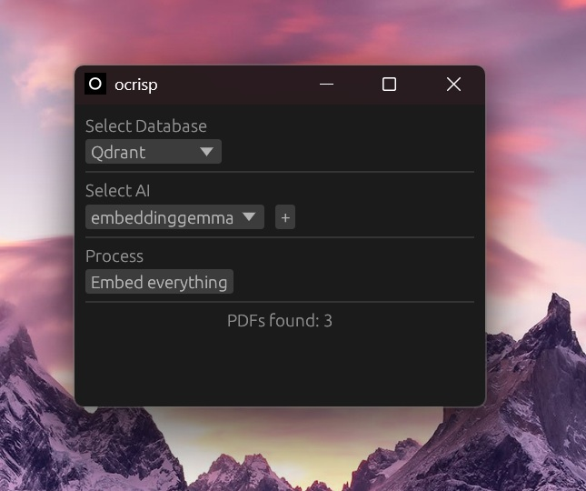
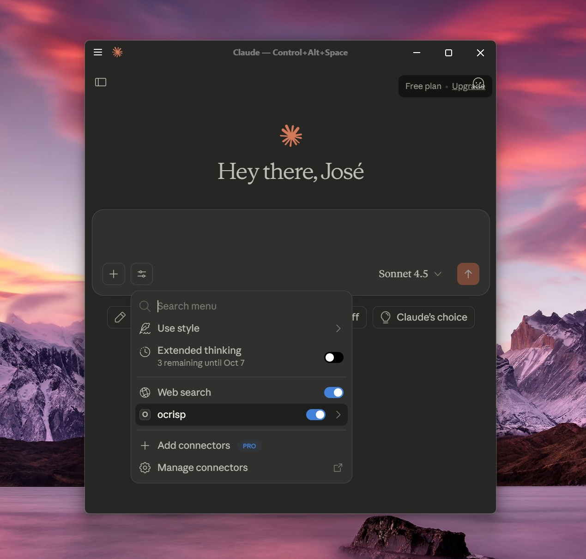

# OCRISP

One-Click RAG Implementation, Simple and Portable
<p align="center">
  
  <br/>
  <em>Simple Desktop App</em>
</p>

<p align="center">
  
  <br/>
  <em>Connect via MCP</em>
</p>

## What OCRISP is

- GUI, CLI and MCP tool. Everything in a single executable

## How it works

- Put all PDFs in the 'data' folder and then embed them.
- Connect with MCP clients to retrieve data 

> [!WARNING]
> This project is early and was made for a specific use-case, so it lacks many features.
> Improvements will come!

## Requirements

- [Qdrant](https://github.com/qdrant/qdrant) in your PATH.
- [Ollama](https://github.com/ollama/ollama) installed.

## Install MCP 

### Claude Desktop 

1. Locate config file. In Windows: `%APPDATA%\Claude\claude_desktop_config.json`

2. Modify, adding this entry. Replace with the actual path of ocrisp.
```json
{
  "mcpServers": {
    "ocrisp": {
      "command": "C:\\path\\to\\your\\ocrisp.exe",
      "args": ["mcp"]
    }
  }
}
```

3. Save and restart Claude Desktop.

## To do:

- Support other Vector Databases (LanceDB next?)